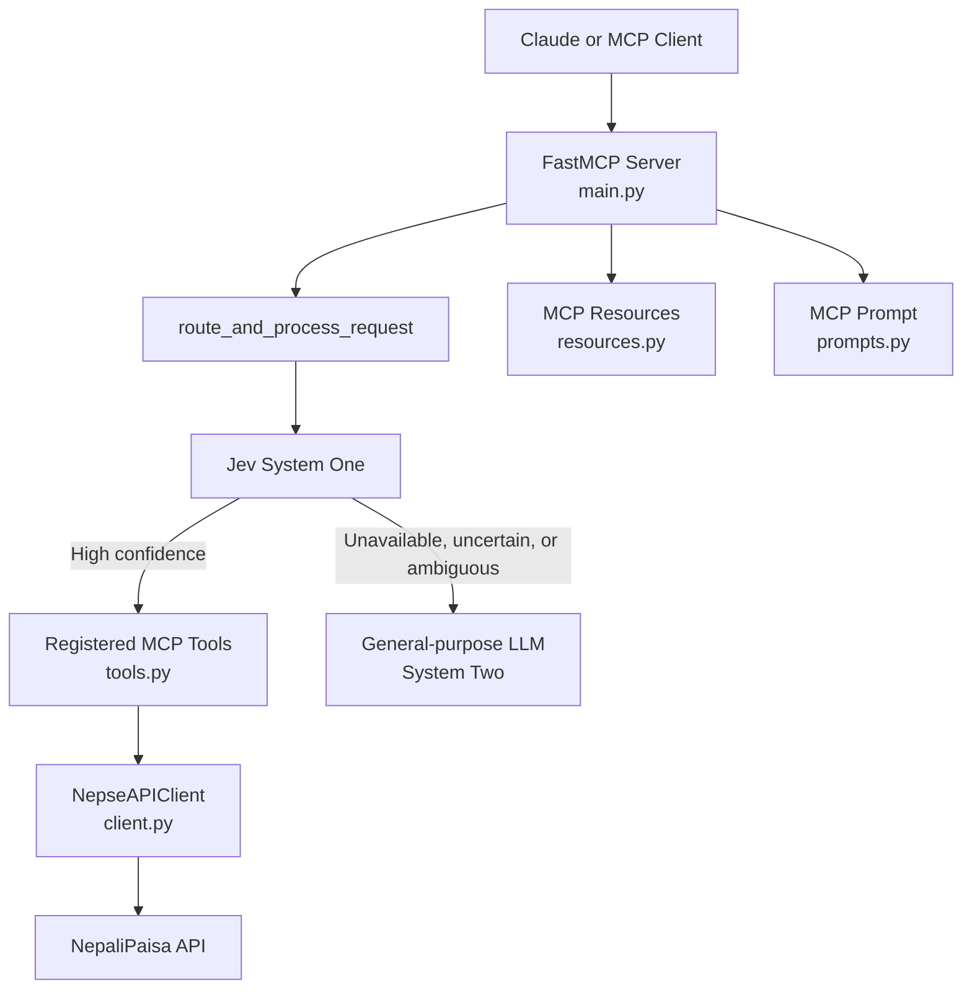

# NEPSE MCP Server

An [MCP (Model Context Protocol)](https://modelcontextprotocol.io/) server that gives Claude and other MCP clients access to Nepal Stock Exchange (NEPSE) market data through the unofficial [NepaliPaisa API](https://nepalipaisa.com).

> **Important:** This project uses an unofficial, reverse-engineered API for learning and experimentation. Availability, rate limits, response formats, and terms of use are not guaranteed. The data is not financial advice, and this server does not execute trades or make investment recommendations.

## What It Provides

### Tools

- `route_and_process_request` — classifies a natural-language request with Jev System One and safely delegates high-confidence requests.
- `search_companies` — searches the NEPSE directory by company name or ticker.
- `get_live_market_data` — retrieves current data for one stock or the whole market.
- `get_stock_snapshot` — returns a compact live snapshot for one stock.
- `get_price_history` — retrieves daily OHLC and volume data with date-range pagination.
- `get_price_history_summary` — calculates compact returns, moving averages, volatility, drawdown, and trend metrics.
- `get_dividend_history` — retrieves bonus shares, cash dividends, rights issues, and book-closure dates.
- `get_top_market_movers` — ranks stocks by gainers, turnover, or shares traded.
- `compare_stocks` — ranks multiple stocks by price, change, volume, turnover, or 30-day return.
- `get_market_glossary` — returns definitions for market fields and response flags.
- `get_analysis_rules` — returns rules and caveats for interpreting market data.
- `evaluate_jev_decision` — exposes the generic Jev decision endpoint for structured input.
- `evaluate_stock_risk_and_momentum` — sends calculated market metrics to Jev for analysis only; it never executes trades.

### Resources

- `nepse://companies` — full company and ticker directory.
- `nepse://market-glossary` — field, indicator, sector, and response-flag definitions.
- `nepse://analysis-rules` — interpretation rules and data caveats.

### Prompt

- `analyze_nepse_stock` — creates a guided analysis workflow covering live price, recent price history, and dividend history. It does not cover fundamentals such as EPS, P/E, revenue, or profit growth.

## Requirements

- Python 3.12 or newer
- [uv](https://docs.astral.sh/uv/getting-started/installation/)
- A Jev API key for request routing and Jev analysis

## Setup

Clone the repository and install its dependencies:

```bash
git clone <repository-url>
cd Nepse_Mcp
uv sync
```

Create the local environment file:

```bash
cp .env.example .env
```

At minimum, set one of the following credentials in `.env` when using Jev features:

```dotenv
JEVMODEL_API_KEY=your_api_key_here
# JEV_API_KEY=your_api_key_here
# TYPESAFE_API_KEY=your_api_key_here
```

Direct NepaliPaisa tools do not require a Jev key. Jev is required by `route_and_process_request`, `evaluate_jev_decision`, and `evaluate_stock_risk_and_momentum`.

## Configuration

The available environment variables are defined in `.env.example`:

| Variable | Default | Purpose |
|---|---|---|
| `JEVMODEL_API_KEY` | None | Preferred Jev API credential |
| `JEV_API_KEY` | None | Alternative Jev API credential |
| `TYPESAFE_API_KEY` | None | Legacy or alternative Jev credential |
| `JEV_API_URL` | `https://jevmodel.org/v1/systemone` | Jev System One endpoint |
| `JEV_MODEL` | `jev-latest` | Jev model name |
| `JEV_CONFIDENCE_THRESHOLD` | `0.70` | Minimum confidence required for automatic routing |
| `JEV_HTTP_TIMEOUT` | `30.0` | Jev request timeout in seconds |
| `NEPALIPAISA_BASE_URL` | `https://nepalipaisa.com/api` | NepaliPaisa API base URL |
| `NEPSE_HTTP_TIMEOUT` | `10` | NepaliPaisa request timeout in seconds |
| `LOG_LEVEL` | `INFO` | Application log level |
| `LANGSMITH_TRACING` | Optional | Enables LangSmith tracing when configured |
| `LANGSMITH_API_KEY` | Optional | LangSmith API credential |
| `LANGSMITH_PROJECT` | `nepse-mcp` | LangSmith project name |

Do not use `HTTP_TIMEOUT`; `uv` reserves that name. This project uses `NEPSE_HTTP_TIMEOUT` and `JEV_HTTP_TIMEOUT` instead.

## Run the Server

Start the server over MCP stdio:

```bash
uv run nepse-mcp
```

The server registers its tools, resources, and prompt from `src/nepse_mcp/main.py`.

## How Jev Routing Works

`route_and_process_request` is the recommended entry point for natural-language NEPSE requests.

1. The MCP client sends the user's request to the routing tool.
2. Jev System One classifies the request and returns a selected tool, confidence, and probabilities.
3. The server only executes an allowlisted tool when confidence is at least `JEV_CONFIDENCE_THRESHOLD` and the required arguments can be extracted safely.
4. High-confidence requests are delegated to the selected NEPSE tool.
5. The selected tool calls `NepseAPIClient`, which calls the NepaliPaisa API and validates its response.
6. The server returns compact, structured data with completeness and warning metadata.

### Jev fallback to the LLM

The server does not guess when Jev cannot safely make a routing decision. It returns a fallback response when Jev is unavailable, times out, rejects authentication, returns malformed data, selects `llm_fallback`, has confidence below the configured threshold, or cannot extract required arguments.

Example:

```json
{
  "status": "fallback",
  "system": "jev-system-one",
  "reason": "jev_unavailable",
  "next_system": "system-two-llm"
}
```

The connected MCP client or general-purpose LLM is responsible for continuing after this response. It may ask for clarification, call a direct tool, or handle the request itself. Direct NEPSE tools remain available even when Jev is unavailable.

`evaluate_stock_risk_and_momentum` is different: it requires Jev to evaluate a prepared market-data state and returns an error if Jev is unavailable. It is analysis-only and never issues or executes a trade.

## Architecture



The main layers are:

- `main.py` creates the FastMCP server and registers all capabilities.
- `tools.py` validates tool inputs, calls the API client, normalizes output, and handles Jev routing.
- `client.py` provides the asynchronous NepaliPaisa API client, including HTTP error handling and pagination.
- `schemas.py` defines typed API and response models.
- `resources.py` exposes the company directory and static interpretation guidance.
- `prompts.py` builds the guided stock-analysis prompt.
- `utils.py` contains ticker/date validation, response envelopes, compact transformations, and Jev API handling.

## Claude Desktop Integration

Claude Desktop configuration files are located at:

| Platform | Config path |
|---|---|
| Linux | `~/.config/Claude/claude_desktop_config.json` |
| macOS | `~/Library/Application Support/Claude/claude_desktop_config.json` |
| Windows | `%APPDATA%\Claude\claude_desktop_config.json` |

Add the following server entry and replace the paths with the absolute path to this repository:

```json
{
  "mcpServers": {
    "nepse-market-data": {
      "command": "/home/username/.local/bin/uv",
      "args": [
        "--directory",
        "/absolute/path/to/Nepse_Mcp",
        "run",
        "nepse-mcp"
      ]
    }
  }
}
```

Use `which uv` to find the correct path to `uv`. Claude Desktop does not hot-reload this file, so fully restart the application after changing it.

To test the exact command outside Claude Desktop:

```bash
uv --directory /absolute/path/to/Nepse_Mcp run nepse-mcp
```

If Claude reports that the server is disconnected, check the Claude MCP log for your platform and run the command manually to see startup errors. Common causes are an incorrect `uv` path, a missing `.env` file, an invalid Jev key, or an unavailable upstream API.

## Development

Run the test suite:

```bash
uv run pytest
```

Run tests with verbose output:

```bash
uv run pytest -v
```

## Data and Safety Notes

- NepaliPaisa is an unofficial upstream source and may be delayed, incomplete, unavailable outside trading hours, or changed without notice.
- Monetary values are reported in Nepalese Rupees (NPR or Rs.).
- Dividend bonus, cash, and total values are percentages, not cash amounts per share.
- Paginated responses include `has_more_data`, `data_complete`, `warning`, and `source_gap_detected` information where applicable.
- Missing prices, history, dividends, rankings, or derived metrics must be reported as unavailable; they must not be invented.
- Trend and Jev outputs are descriptive analysis signals, not investment advice.
